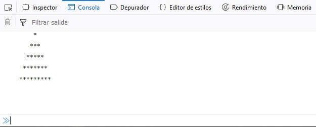

# Aprende un lenguaje de programación en un día (ejercicio voluntario para subir nota).

## Miembros del grupo

Escribe aquí los miembros del grupo. El primero es el representante o encargado.

* Alejandro de la Maza Villalba
* David Balsas Martín
* Alejandro Ruiz López

## Lenguaje de programación

El profesor llevará una cajita llena de papelitos con los nombres de distintos lenguajes de programación. Los encargados de cada grupo meterán la mano en la caja y sacarán dos papelitos, de los cuales el grupo elegirá uno. Se permite hacer intercambio de papelitos entre grupos.

Escribe el lenguaje de programación elegido por el grupo.

* TypeScript


Los papelitos se han recortado de este [documento](lenguajes_de_programacion.pdf).

## Información sobre el lenguaje

TypeScript es un lenguaje de programación libre y de código abierto desarrollado y mantenido por Microsoft, e implementa muchos de los mecanismos más habituales de la programación orientada a objetos, pudiendo extraer grandes beneficios que serán especialmente deseables en aplicaciones grandes, capaces de escalar correctamente durante todo su tiempo de mantenimiento. Este puede ser usado para desarrollar aplicaciones que se ejecutarán en el lado del cliente o del servidor.
La característica fundamental de TypeScript es que compila en Javascript nativo, por lo que se puede usar en todo proyecto donde este use; y el navegador, o cualquier otra plataforma donde se ejecuta, nunca llegará a enterarse del código original.
En resumen, TypeScript es lo que se conoce como un "superset" de Javascript, aportando herramientas avanzadas para la programación que traen grandes beneficios a los proyectos.
La ventaja de los superset es que los lenguajes basados en un estándar evolucionan mucho más lento que las necesidades de los desarrolladores. Entonces surgen estos para expandir un lenguaje, aportando todas las herramientas que no tienen los originales para desarrollar en mejores condiciones.

## Herramientas de desarrollo

Para empezar a programar en TypeScript, necesitamos instalar primero Node.js, preferiblemente la version LTS que podemos encontrar en su página oficial:


[Enlace a la página oficial](https://nodejs.org/en)


Una vez instalado abrimos el terminal y escribimos el comando:
```
npm install typescript -g
```
## Visual studio code

Si usamos Visual Studio Code no tendremos que seguir pasos adicionales, el mismo reconoce los archivos que creemos con la extension .ts por defecto.


[Descargar Visual Studio Code](https://code.visualstudio.com)

## Netbeans

Para trabajar con Netbeans en windows tendremos que instalar aparte la consola Cygwin:


[Descargar Cygwin](http://www.cygwin.com/)

Necesitaremos tambien instalar el complemento nbm para Netbeans

[Descargar complemento](https://github.com/Everlaw/nbts/releases/download/v2.3.3.0/netbeanstypescript-2.3.3.0.nbm)

Lo instalaremos en Netbeans en el menú Tools > Plugins > Add plugins. Reiniciamos Netbeans y listo.


## Poniendo en práctica el lenguaje

Pon en práctica el lenguaje de programación realizando los siguientes ejercicios. Para cada uno de los ejercicios, pega el código fuente de la solución y una captura de pantalla.

### 1. ¡Hola mundo!

Creamos un archivo html:
```html
<html>
<head>
	<title>Hola mundo</title>
</head>
<body>

	<script src="HolaMundo.js"></script>

</body>
</html>
```

Creamos un archivo HolaMundo.ts:

```typescript
alert('hello world in TypeScript!');
```
y lo compilamos poniendo en la consola:

```
tsc C:\ruta del archivo .ts\
```

Como resultado ontendremos el archivo .js al que llamamos en el anterior html, al abrir el html con un navegador nos mostrara la siguiente ventana:


### 2. Pirámide

```typescript
/* Prueba.ts */
let altura = ~~(prompt());
//let altura = 5;
let caracter = "*";
let cantEsp = 0;
let cantPint = 0;
let espacio = " ";

// Operaciones y Salida de Datos
for (let i = 0; i < altura; i++) {

  cantEsp = altura - i;
  cantPint = i + (i + 1);
  
  // Pintar
  let pintarEspacios = ""; // Creo una variable que contiene los espacios
  let pintarAsteriscos = ""; // // Creo una variable que contiene los asteriscos
  for (let j = 1; j <= cantEsp; j++) {
    pintarEspacios += " ";// concateno los espacios
  }

  for (let k = 1; k <= cantPint; k++) {
    pintarAsteriscos += "*"; // concateno los asteriscos
  }
  console.log(pintarEspacios+pintarAsteriscos);
}
```

Como resultado en la consola primero nos pedira que introduzcamos la altura:


Al aceptar nos mostrara la piramide de asteriscos con la altura dada:




### 3. Arrays y números aleatorios

```typescript
// Defino Array
let conjuntoNumeros = [];
let contNumInt = 0;
let totNum = 20;
// Introducción de datos y coperaciones
do {
  let numAle = (Math.random() * 100);
  let numEntero = ~~numAle; // Casting a entero
  conjuntoNumeros[contNumInt] = numEntero;
  contNumInt++;
} while (contNumInt < totNum);

// Array Desordenado
let pintaArray = "";
for (let k = 0; k <= (totNum - 1); k++) {
  pintaArray += conjuntoNumeros[k] + " ";
}
console.log("Array Desordenado: "+pintaArray);

//Array de primos y no primos
let conjuntoPrimos = [];
let contadorPrimos = 0;
let conjuntoNoPrimos = [];
let contadoNoPrimos = 0;
let contDivisores = 2;

for (let k = 0; k <= (totNum - 1); k++) {
  let cifra = conjuntoNumeros[k];
  contDivisores = 2; // No puede ser 1
  let pregPrimo = true; //Presupone que el número es primo
  do {
    if (cifra % contDivisores == 0 && cifra != contDivisores) {
      pregPrimo = false; // Si encuentra un divisor: Ya no es primo
    }
    contDivisores++;
  } while (contDivisores < cifra && pregPrimo == false);
  // Es menor que "<" porque np ùede ser el misom número
  if (pregPrimo == true) {
    conjuntoPrimos[contadorPrimos] = cifra;
    contadorPrimos++;
  } else {
    conjuntoNoPrimos[contadoNoPrimos] = cifra;
    contadoNoPrimos++;
  }
}

// Pintar Array Primos
let pintaArrayPrimos = "";
for (let k = 0; k <= (contadorPrimos-1); k++) {
  pintaArrayPrimos += conjuntoPrimos[k] + " ";
}
console.log("Array Auxiliar de Primos: "+pintaArrayPrimos);

// Pintar Array No Primos
let pintaArrayNoPrimos = "";
for (let k = 0; k <= (contadoNoPrimos-1); k++) {
  pintaArrayNoPrimos += conjuntoNoPrimos[k] + " ";
}
console.log("Array Auxiliar de No Primos: "+pintaArrayNoPrimos);

// Componer Array Final
let conjuntoFinal = [];
for (let k = 0; k <= (totNum - 1); k++) {
  if (k <= (contadorPrimos-1) ) {
    conjuntoFinal[k] = conjuntoPrimos[k];
  } else {
    conjuntoFinal[k] = conjuntoNoPrimos[(k-contadorPrimos)];
  }
}

// Pintar Array Final
let pintaArrayFinal = "";
for (let k = 0; k <= (totNum - 1); k++) {
  pintaArrayFinal += conjuntoFinal[k] + " ";
}
console.log("Array Ordenado: "+pintaArrayFinal);
```

Como resultado en la consola obtendremos: 


## Presentación de resultados

Cada equipo explicará al resto de la clase lo aprendido durante la realización del ejercicio. Todos los miembros de cada equipo deben participar en la explicación. Se puede utilizar como material de base para la presentación el repositorio de GitHub.

## Recompensa

* Todos los alumnos que realicen correctamente la actividad tendrán 0'25 puntos extra en la nota del trimestre.

* Los miembros del equipo más votado ganarán un premio.

:star: Si te ha gustado este ejercicio, dale una estrellita al [repositorio original](https://github.com/LuisJoseSanchez/aprende-un-lenguaje-en-un-dia).

